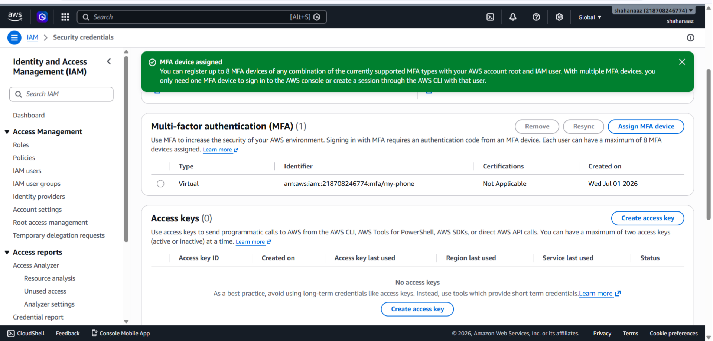
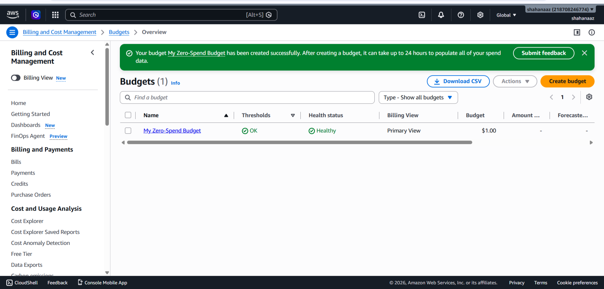
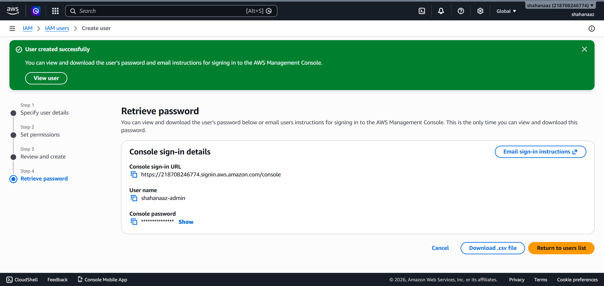
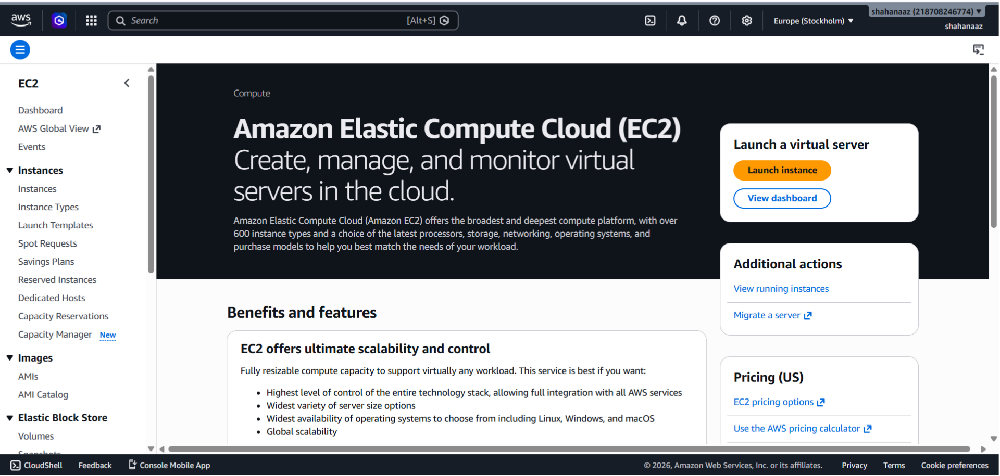
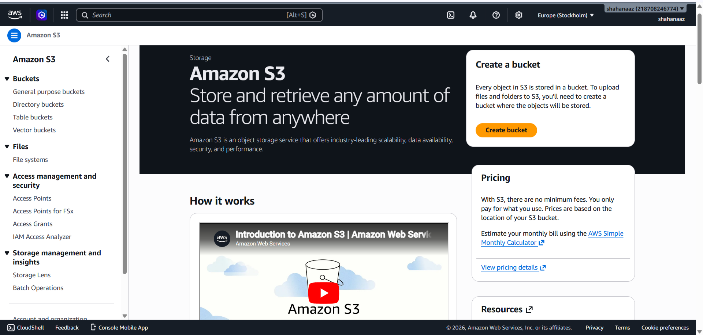
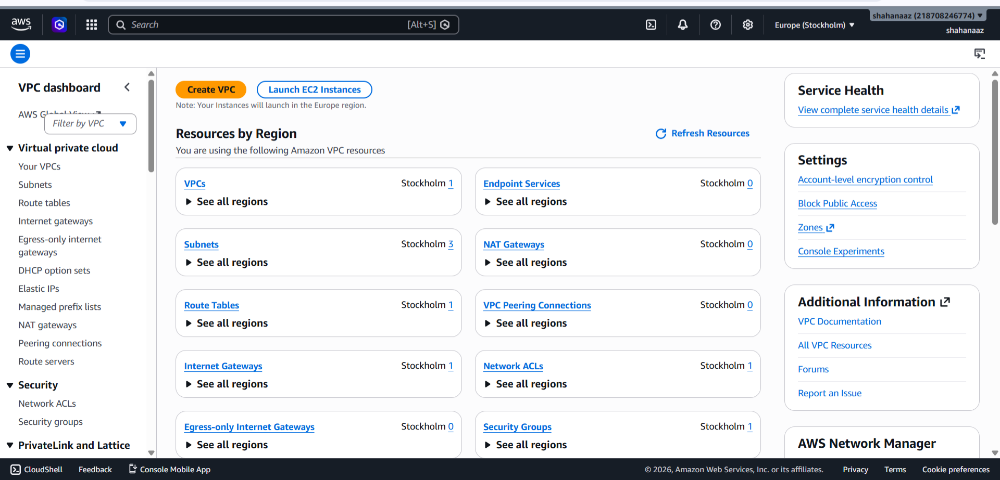

# Cloud Concepts Report
**Name**: Shahanaaz  
**Internship**: Cloud Computing - AWS  
**Date**: July 2026

## 1. Cloud Deployment Models

### Public Cloud
Public cloud is owned and managed by a cloud provider like AWS. 
Many users share the same infrastructure over the internet. 
It is cost-effective and easy to scale.  
*Example:* Amazon Web Services (AWS)

### Private Cloud
Private cloud is used by only one organization. 
It gives more control and security but is more expensive.  
*Example:* A bank running its own private data center.

### Hybrid Cloud
Hybrid cloud is a combination of both public and private cloud. 
Sensitive data stays in private cloud and other workloads 
run on public cloud.  
*Example:* A company storing customer data privately 
but hosting its website on AWS.

### Community Cloud
Shared by several organizations with similar requirements.
Shared cost,Good security,Easy collaboration but less flexible
than a private cloud.
*Example:* Multiple Universities sharing one cloud for research.

## 2. Cloud Service Models

### IaaS - Infrastructure as a Service
The cloud provider gives basic infrastructure like servers, 
storage and networking. The user manages everything else 
like the operating system and applications.  
*Example:* Amazon EC2

### PaaS - Platform as a Service
The cloud provider manages the infrastructure and platform. 
The user only focuses on writing and deploying their code.  
*Example:* AWS Elastic Beanstalk

### SaaS - Software as a Service
The cloud provider manages everything including the application. 
The user just logs in and uses the software.  
*Example:* Gmail, Dropbox, Netflix

## 3. AWS Account Security Setup

### Multi-Factor Authentication (MFA)
I enabled MFA on my AWS Root user account using 
Google Authenticator app. MFA adds an extra layer of 
security by requiring a 6-digit code from my phone 
every time I log in, along with my password.

### Billing Alarm
I created a Zero Spend Budget in AWS Billing console. 
This budget will send an alert to my email immediately 
if any charges occur on my AWS account. This protects 
me from unexpected charges during my internship.

### IAM Admin User
I created an IAM user called "shahanaaz-admin" with 
AdministratorAccess permissions. From now on I will 
use this IAM user for daily AWS activities instead 
of the Root account, which is a security best practice.

## 4. Core AWS Services Explored

### Amazon EC2 (Elastic Compute Cloud)
Amazon EC2 provides virtual servers called instances 
in the cloud. It allows users to run applications 
without buying physical hardware. EC2 offers different 
instance types based on CPU, memory and storage needs.

### Amazon S3 (Simple Storage Service)
Amazon S3 is an object storage service used to store 
and retrieve any amount of data from anywhere. Files 
are stored inside containers called buckets. S3 is 
used for storing images, videos, backups and website files.

### Amazon VPC (Virtual Private Cloud)
Amazon VPC allows users to create a private isolated 
network inside AWS. It includes Subnets, Route Tables, 
Internet Gateways and Security Groups to control 
network traffic. AWS creates a default VPC 
automatically in each region.

## 5. Conclusion
In this internship task I learned about cloud deployment 
models and service models. I created an AWS Free Tier 
account, secured it with MFA, set up a billing alarm 
and created an IAM admin user. I also explored core 
AWS services like EC2, S3 and VPC.

