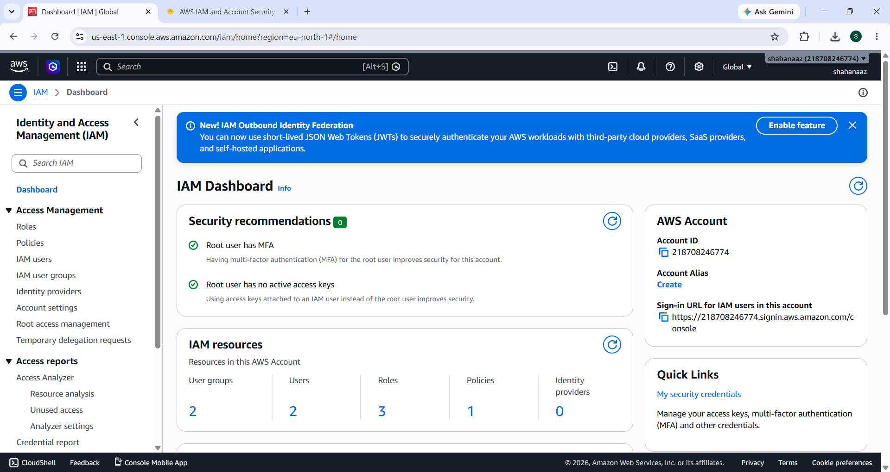
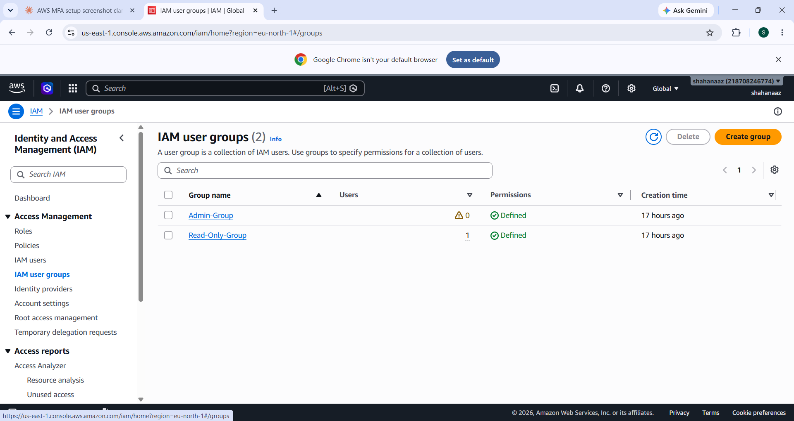
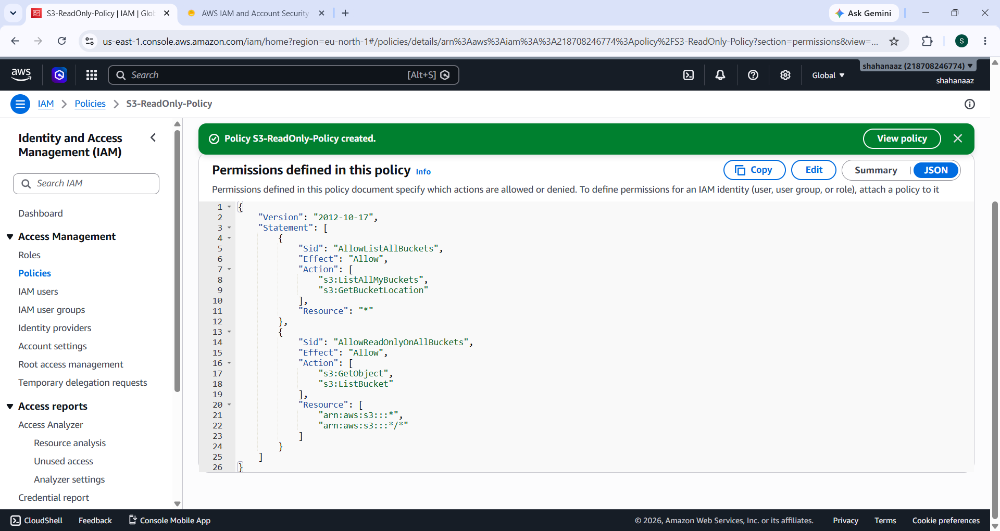
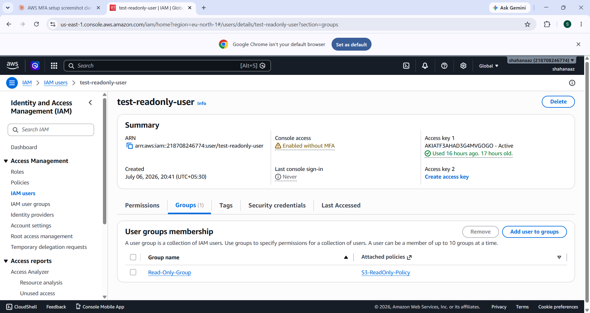

# Task 2: IAM Security Implementation Report

## 1. Objective

The goal of this task was to secure an AWS account by implementing identity and access
management (IAM) best practices. This included enabling multi-factor authentication (MFA)
on the root account, creating IAM groups to manage permissions collectively, defining a
least-privilege custom policy for S3 read-only access, and validating that the restricted
permissions actually work by testing them with the AWS CLI.

## 2. Security Principles Applied

- **Principle of Least Privilege** — The test user was granted only the exact permissions
  needed to list buckets and read objects from S3, nothing more. No write, delete, or
  admin-level actions were allowed.
- **Separation of Duties via Groups** — Instead of attaching policies directly to individual
  users, permissions were assigned through IAM groups (`Admin-Group` and `Read-Only-Group`),
  which makes access easier to manage, audit, and scale.
- **Root Account Protection** — The root user was secured with MFA and confirmed to have no
  active access keys, following AWS's recommendation to never use the root account for
  day-to-day operations.
- **Verifiable Access Control** — Rather than assuming the policy worked, the restricted
  permissions were actively tested using the AWS CLI, with both the success and failure
  scenarios documented as evidence.

## 3. Step-by-Step Implementation

### Step 1 — Secure the Root Account
- Enabled Multi-Factor Authentication (MFA) on the root user via **IAM → Dashboard →
  Security recommendations**.
- Confirmed via the IAM Dashboard that:
  - ✅ Root user has MFA
  - ✅ Root user has no active access keys

### Step 2 — Create IAM Groups
Two IAM user groups were created to manage permissions collectively rather than per-user:

- **Admin-Group** — intended for administrative access.
- **Read-Only-Group** — intended for restricted, read-only access to S3.

### Step 3 — Define a Custom Least-Privilege IAM Policy
A custom JSON policy, `S3-ReadOnly-Policy`, was created to allow only read-level access to
Amazon S3:

- `s3:ListAllMyBuckets` and `s3:GetBucketLocation` — to list buckets.
- `s3:GetObject` and `s3:ListBucket` — to read objects within any bucket.
- No write (`PutObject`), delete (`DeleteObject`), or bucket-creation (`CreateBucket`)
  permissions were included.

The full policy is available at [`policies/s3-readonly-policy.json`](../policies/s3-readonly-policy.json).

### Step 4 — Attach Policy and Assign Test User
- The `S3-ReadOnly-Policy` was attached to the `Read-Only-Group`.
- A new IAM user, `test-readonly-user`, was created and added to `Read-Only-Group`.
- Console sign-in credentials and programmatic access keys were generated for this user.

### Step 5 — Test Permissions via AWS CLI
The AWS CLI was configured with a dedicated profile (`readonly-test`) using the test user's
access keys, then used to validate both allowed and denied actions:

| Command | Expected Result | Actual Result |
|---|---|---|
| `aws s3 ls --profile readonly-test` | ✅ Success (read allowed) | Buckets listed successfully |
| `aws s3 mb s3://test-bucket-shahanaz-12345 --profile readonly-test` | ❌ Denied (write/create not allowed) | `AccessDenied` — as expected |

The `CreateBucket` attempt correctly failed with:

> `An error occurred (AccessDenied) when calling the CreateBucket operation: User:
> arn:aws:iam::218708246774:user/test-readonly-user is not authorized to perform:
> s3:CreateBucket ... because no identity-based policy allows the s3:CreateBucket action`

This confirms the least-privilege policy is working exactly as intended — the user can read
but cannot create, modify, or delete S3 resources.

Full CLI output is available at [`logs/cli-test-results.txt`](../logs/cli-test-results.txt).

## 4. Evidence Summary

| Evidence File | Description |
|---|---|
| `evidence-mfa.png` | Confirms MFA is enabled on the root account |
| `evidence-iam-groups.png` | Shows `Admin-Group` and `Read-Only-Group` created |
| `evidence-policy.png` | Shows the custom `S3-ReadOnly-Policy` JSON in the IAM console |
| `evidence-test-user.png` | Shows the `test-readonly-user` created and credentials issued |
| `logs/cli-test-results.txt` | Terminal output proving read access works and write access is denied |

## 5. Conclusion

This task demonstrated a practical, verifiable application of AWS IAM security best
practices: securing the root account with MFA, organizing permissions through groups
instead of individual users, writing a least-privilege custom policy, and — most
importantly — **proving** the restriction works through direct CLI testing rather than
just assuming the policy configuration is correct. This approach reduces the attack
surface of the AWS account and ensures that even if the test user's credentials were
compromised, the damage would be limited to read-only access.
