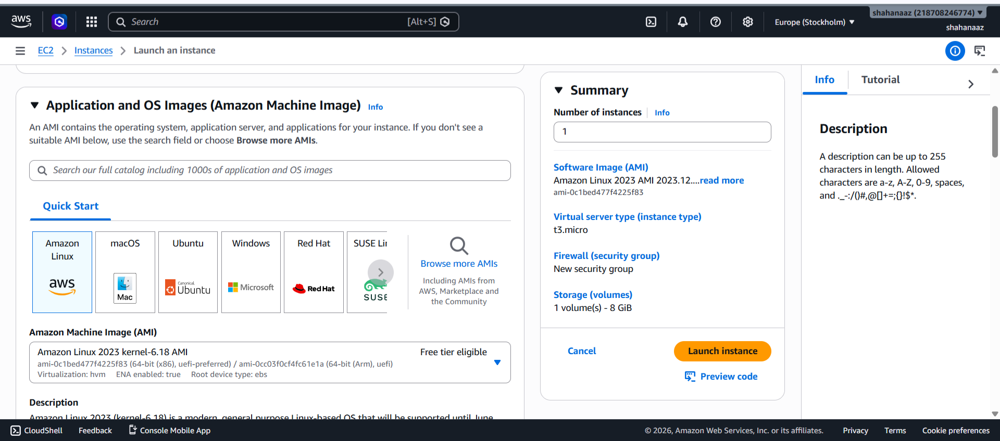
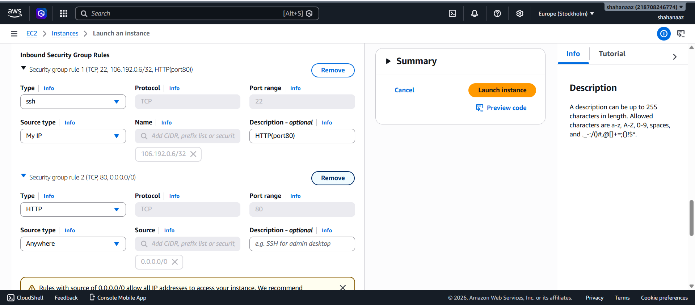
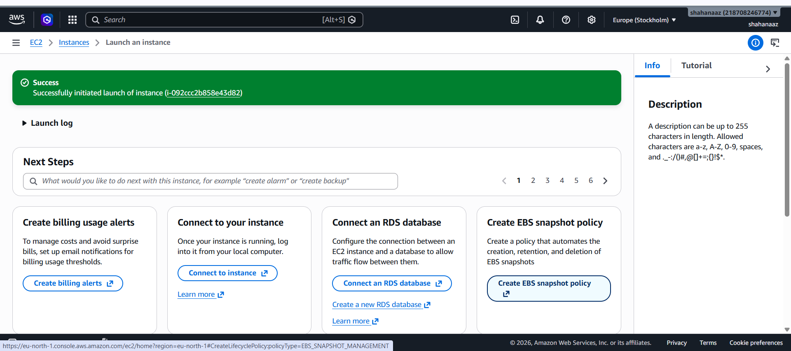
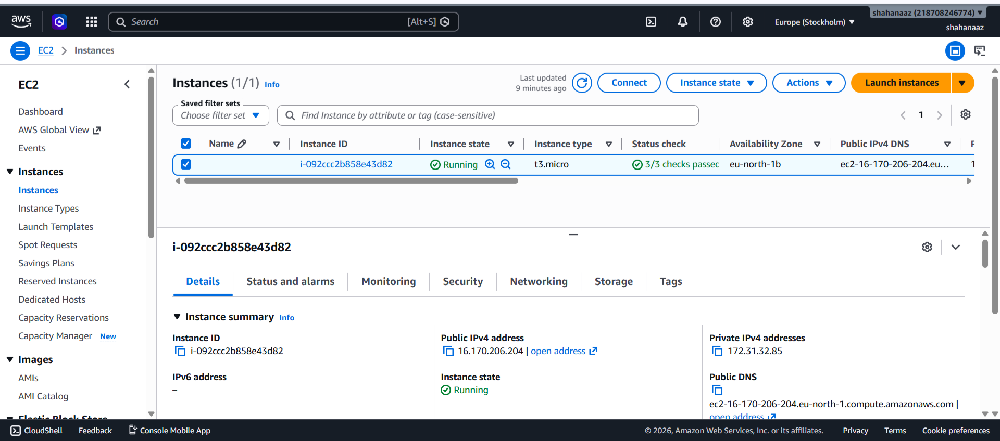
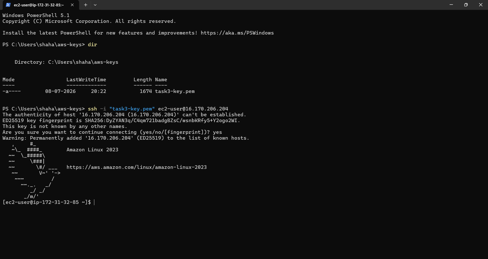
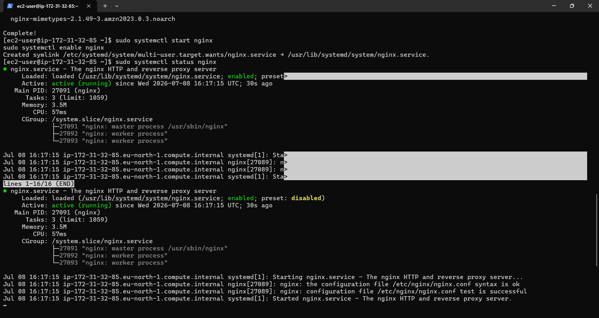
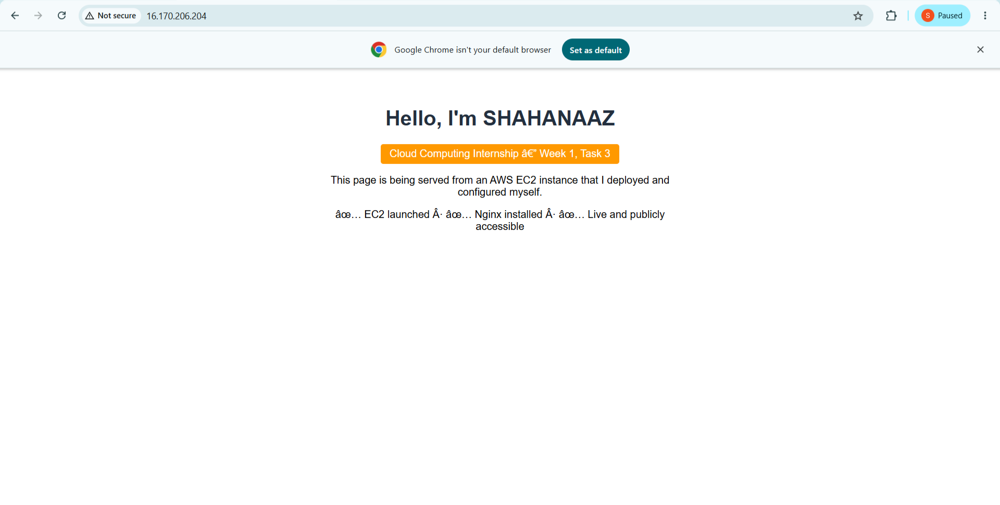
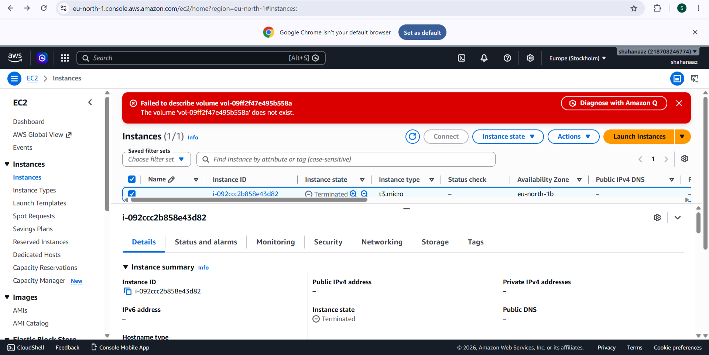

# Week 1 – Task 3: EC2 Web Server Deployment

## Overview
This task involved launching an AWS EC2 instance, configuring security group rules, connecting via SSH, installing a web server, and deploying a custom HTML landing page — all within the AWS Free Tier.

**Intern:** Shahanaaz
**Program:** AWS Cloud Computing Internship
**Task:** Week 1, Task 3

---

## Deployment Summary

| Item | Detail |
|---|---|
| Region | Europe (Stockholm) – `eu-north-1` |
| AMI | Amazon Linux 2023 |
| Instance Type | `t3.micro` (see note below) |
| Web Server | Nginx |
| Key Pair | `task3-key.pem` (RSA, not committed to repo) |
| Public IPv4 | `16.170.206.204` (released after termination) |

---

## Step-by-Step Process

### 1. Launch EC2 Instance
Logged into the AWS Management Console, navigated to EC2 → Launch Instance, and selected the **Amazon Linux 2023 AMI** (Free Tier eligible).

 

**Note:** The task specified `t2.micro`, but AWS's `eu-north-1` (Stockholm) region offers `t3.micro` as the default Free Tier instance type instead. `t3.micro` was used, and it remains fully covered under the AWS Free Tier.

### 2. Configure Security Group
Created a new security group (`launch-wizard-1`) with two inbound rules:
- **SSH (port 22)** — Source: My IP
- **HTTP (port 80)** — Source: Anywhere (0.0.0.0/0)



**Challenge faced:** Initially attempted to add the HTTP rule by editing the *description* field of the SSH rule instead of creating a genuinely separate rule. Corrected this by clicking "Add security group rule" to create a distinct HTTP rule with its own type, port, and source.

### 3. Launch and Verify Instance
Created a new RSA key pair (`task3-key.pem`) during launch, then clicked Launch Instance.



Waited for the instance to reach **Running** state with status checks passed, then noted the Public IPv4 address.



### 4. Connect via SSH
On Windows, moved `task3-key.pem` into a dedicated folder (`C:\Users\shaha\aws-keys`) and opened PowerShell directly inside that folder. Connected using:

```bash
ssh -i "task3-key.pem" ec2-user@16.170.206.204
```

Accepted the host fingerprint prompt (`yes`) on first connection.



### 5. Install Nginx Web Server
Updated packages and installed Nginx using the automation script (see `scripts/install-webserver.sh`):

```bash
sudo dnf update -y
sudo dnf install nginx -y
sudo systemctl start nginx
sudo systemctl enable nginx
```

Verified the service was active and enabled to start on boot:

```bash
sudo systemctl status nginx
```



### 6. Deploy Custom HTML Page
Replaced the default Nginx landing page with a custom `index.html` (see `src/index.html`) displaying my name, internship details, and deployment confirmation. Restarted Nginx to apply changes.

Verified public accessibility by visiting `http://16.170.206.204` in a browser.



### 7. Terminate Instance
Once the deployment was fully verified, terminated the instance from the EC2 console to avoid ongoing AWS charges.



---

## Challenges Faced

1. **Instance type availability** — `t2.micro` was not offered in `eu-north-1`; used `t3.micro` instead, which is equally Free Tier eligible.
2. **Security group rule setup** — Initially tried to repurpose one rule's description instead of adding a second rule; resolved by explicitly adding a distinct HTTP rule.
3. **Windows terminal path navigation** — Learned to open PowerShell directly inside a target folder via the File Explorer address bar, avoiding manual `cd` typing errors.
4. **SSH session persistence** — Closing the laptop dropped the SSH session (expected behavior); reconnected successfully using the same key and public IP since the instance was still running.

---

## Repository Structure

```
README.md
src/index.html
scripts/install-webserver.sh
assets/screenshots/01-ami-selection.png
assets/screenshots/02-security-group-rules.png
assets/screenshots/03-launch-success.png
assets/screenshots/04-instance-running-public-ip.png
assets/screenshots/05-ssh-connection-success.png
assets/screenshots/06-webserver-installed.png
assets/screenshots/07-live-webpage.png
assets/screenshots/08-instance-stopped.png
```

---

## Key Learnings
- Hands-on experience launching and configuring EC2 instances from scratch
- Understanding of security groups as virtual firewalls (inbound/outbound rules)
- Secure SSH key-based authentication and connection management
- Installing, starting, and enabling a web server (Nginx) on Amazon Linux 2023
- Importance of terminating unused cloud resources to control costs
